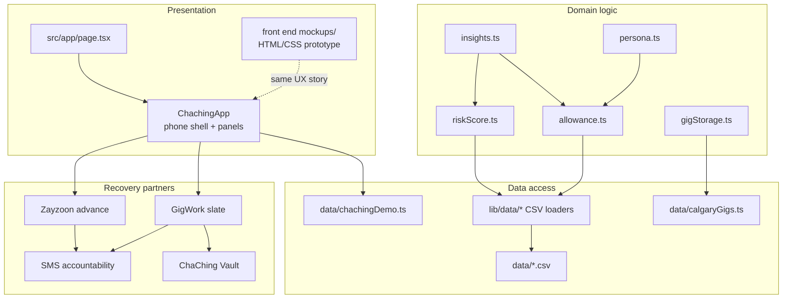
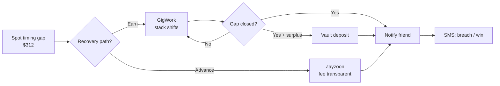

# ChaChing

**Beyond money in / money out — a same-day cash-flow tool for daily earners.**

The hackathon asked what someone who gets paid by the day would actually find valuable. Research and industry data point to the same answer: **timing**, not monthly totals.

ChaChing surfaces **cash timing gaps** (rent Friday, pay Saturday), scores **overspend risk**, then closes the shortfall with two partner paths:

| Path | What it does |
| --- | --- |
| **GigWork** | Same-day Calgary shifts matched to today’s gap — you earn the shortfall, $0 advance fee |
| **Zayzoon** | Earned-wage advance on pay you’ve already worked — transparent fee, repaid from the next deposit |

Friend accountability runs on both slips and wins. Budgeting alone does not grow income. ChaChing turns a shortfall into **work** or **early access to wages already earned**.

---

## Why this is useful (grounded in the real problem)

Daily and gig earners don’t fail because they can’t read a pie chart. They fail because **fixed bills and variable pay don’t share a calendar**.

- **The “timing tax”** — Surveys of renters using payment-flexibility tools find ~**31%** sometimes, rarely, or never have enough cash when rent is due — *not because they lack earnings*, but because pay and rent dates misalign ([HousingWire / Flex](https://www.housingwire.com/articles/rent-timing-tax-workers/)).
- **Income that moves** — The Federal Reserve’s SHED work finds about **one in three** wage earners has income that varies month to month — brutal when rent is a fixed lump sum.
- **Same-day cash is a need, not a nicety** — PYMNTS research finds **~54% of gig workers** (and **~65% of tipped workers**) say they need same-day access to funds; side work is often used for **rent, groceries, and utilities**, not luxuries ([PYMNTS](https://www.pymnts.com/payroll/2026/welcome-to-the-transactional-economy/)).
- **The wrong bridge is expensive** — Typical payday-loan economics can cost ~**$520 to borrow $375**; overdraft/NSF fees hit vulnerable households hardest. ChaChing steers people toward **GigWork** or transparent **Zayzoon** earned-wage access instead.
- **Partners want more than advances** — Industry analyses (e.g. Everest on EWA) show employers moving EWA into **holistic financial wellness** — education, savings, planning — not payday alone. ChaChing matches that shift: gap insight → GigWork or advance → Vault → accountability.

**What a daily earner actually values:** *Can I make it through today — and if not, how do I earn or unlock wages I already worked before tonight?* That is the prompt. That is ChaChing.

---

## Unique value proposition

1. **Timing, not totals** — Enough for the month can still mean short on Friday. We name the dollar gap and *why*.
2. **Close with income via GigWork** — Same-day Calgary shifts matched to the shortfall — valuable when side work is how people cover essentials.
3. **Or unlock wages with Zayzoon** — Transparent advance fee when earning tonight isn’t realistic.
4. **Safer than the default alternatives** — $0-fee GigWork path *or* transparent advance, vs. payday/overdraft spirals.
5. **Accountability that celebrates recovery** — Friends hear about advances *and* completed GigWork shifts.

Judges scoring **Innovation** and **Problem–Solution Fit**: this is day-rate survival infrastructure — not a prettier ledger.

---

## Why this exists (problem → solution)

| What budgeting apps do | What daily earners need |
| --- | --- |
| Monthly totals & leftover charts | A yes / tight / stop decision *today* |
| “You’re over budget” after the fact | Likelihood of blowing past allowance *before* it happens |
| Cut spending advice | Concrete **GigWork** jobs (and transparent advances) to cover the shortfall the same day |
| Silent personal shame | Peer accountability on breaches *and* wins |

**ChaChing is built around timing, not totals — and around earning more, not only spending less.**

---

## Product walkthrough

### 1. Spot the gap — timing, not totals

Rent and bills hit before pay lands. ChaChing names the shortfall, explains *why*, and offers two recovery paths: **GigWork** (earn it) or **Zayzoon** (advance it).


### 2. Close it with GigWork (you earn)

Stack nearby GigWork shifts until the gap hits $0. The worker gets paid for the work. Anything beyond the shortfall can flow into a **ChaChing Vault** (4.50% APY).


### 3. Or advance wages you’ve already earned

Pull the shortfall via **Zayzoon** (fee transparent up front), repaid from the next deposit — with social accountability wired in. GigWork and advance sit side by side so users can compare.


### 4. Pick who has your back

Opt-in friend by phone. They only get texts you’ve approved — advances, gap closed, Vault deposits. They can reply STOP anytime.


### 5. Real accountability texts (not just in-app toasts)

Friends hear both sides: early pay when you’re short, and praise when you finish a GigWork shift and close the gap.


> Interactive HTML prototypes live in [`front end mockups/`](./front%20end%20mockups/) (`index.html`, `imessage-accountability.html`). Open them in a browser for the clickable phone flow — the Next.js app at `/` mirrors the same experience.

---

## Working app demo (Next.js)

The shipped React app is the same phone flow as the HTML mockups:

1. Open `/` → Alex’s **$312 timing gap** (Calgary)  
2. Choose **GigWork** (stack shifts → claim slate → Vault surplus) or **Zayzoon** (advance + fee)  
3. Add an accountability friend and preview SMS on advance / gap closed  
4. Charts, meters, toasts, and overlays match the interactive mockups  

```bash
npm install
npm run dev
```

Open [http://localhost:3000](http://localhost:3000).

| Command | Description |
| --- | --- |
| `npm run dev` | Development server |
| `npm run build` | Production build |
| `npm run start` | Serve production build |
| `npm run lint` | ESLint |

---

## How it maps to the hackathon prompt

> *Build something beyond money in / money out — what would a worker who earns daily actually find valuable?*

| Prompt need | ChaChing answer | Why it’s credible |
| --- | --- | --- |
| Day-to-day earnings reality | Safe allowance from week-to-date pay − prorated essentials ÷ days left | Matches variable daily pay vs fixed bills |
| Beyond in/out ledgers | Overspend **risk score** + history→prediction timeline | Anticipates pressure before the “timing tax” hits |
| Valuable *today* | **GigWork** same-day shifts that pay the exact gap | Aligns with gig workers’ need for same-day cash / side income for essentials |
| Real personal pain | Timing mismatch (bills before pay) + peer recovery signals | Same failure mode documented for renters and irregular-pay workers |
| **Beyond a budgeting tool** | Earn via GigWork *or* unlock wages via Zayzoon | Action paths, not another monthly report |
| Stretch ambition | Advance + Vault + SMS + GigWork marketplace | Matches industry move from EWA-alone → holistic wellness |

---

## Innovation highlights

- **Timing-aware cash gap** — “You earn enough this month; you’re still short Friday” (the documented timing tax)  
- **Explainable overspend risk** — weighted heuristic with readable drivers — not a black box  
- **Income-first recovery** — GigWork slate matched to the shortfall, not only “spend less”  
- **Two clear partners** — GigWork for earn, Zayzoon for earned-wage access  
- **Social accountability that cuts both ways** — notify on advance / breach *and* on GigWork completed / Vault deposit  
- **Vault after gap** — surplus GigWork pay → high-interest vault, not lifestyle creep  

---

## Software design architecture

ChaChing is a **Next.js App Router** client UI that ports the interactive phone prototype. Domain math (allowance, risk, insights) sits behind typed loaders over synthetic Alberta worker CSVs. The shipped demo at `/` is driven by curated narrative data (`chachingDemo`) so the hackathon story stays coherent with the HTML mockups.

### System layers



### Core decision loop



### Layer responsibilities

| Layer | Role |
| --- | --- |
| **Presentation** | `ChachingApp` owns the phone chrome, week/month cash chart, GigWork slate, Zayzoon panel, friend overlay, and SMS previews. `/gigs` redirects into this same home flow. |
| **Domain** | Pure functions compute safe daily allowance, overspend risk + timeline, and daily insights from worker/day inputs. |
| **Data** | CSV loaders (`workers`, `earnings`, `transactions`, `obligations`) feed the math; `chachingDemo` powers the pitch UI; `calgaryGigs` backs optional swipe-deck components. |
| **Partners** | GigWork closes the gap with earned income; Zayzoon unlocks wages already worked; Vault parks surplus; SMS accountability fires on advance and on gap closed. |

### Repository map

```
src/app/                 → routes: / (phone UI), /gigs → /, /api/health
src/components/chaching/ → ChachingApp (React port of mockups)
src/components/dashboard → allowance / risk / decision building blocks
src/components/gigs/     → GigWork swipe deck + cards
src/data/                → chachingDemo narrative + calgaryGigs catalog
src/lib/                 → allowance, risk, insights, CSV access, gigStorage
data/                    → synthetic Alberta worker & cashflow CSVs
scripts/                 → persona / demo-day mining
front end mockups/       → HTML/CSS prototype + submission screenshots
```

---

## Technical execution

**Stack:** Next.js 16 (App Router) · React 19 · TypeScript · Tailwind CSS v4

**Data-backed, not hardcoded UI**

- Typed CSV loaders over synthetic Alberta daily-earner datasets (`data/`) — workers, daily earnings, transactions, recurring obligations  
- Persona mining scripts (`scripts/pick-persona.ts`, `pick-demo-day.ts`) score real CSV workers to pick a believable Calgary demo story  
- Core math: `src/lib/allowance.ts`, `src/lib/riskScore.ts`, `src/lib/insights.ts`  

See **[Software design architecture](#software-design-architecture)** for layered diagrams and the repository map.

**Clever bits**

- Custom SVG risk / cash charts (no chart library)  
- GigWork slate selection with live gap meter + Vault surplus  
- Mockups and Next app share the same Alex / $312 Calgary narrative  

---

## Functional completeness — core loop

| Step | Status |
| --- | --- |
| Spot $312 timing gap | ✅ |
| GigWork slate → claim → Vault | ✅ (Next.js + HTML mockups) |
| Zayzoon advance + fee breakdown | ✅ (Next.js + HTML mockups) |
| Accountability friend + SMS previews | ✅ (Next.js + HTML mockups) |
| Dual paths side by side | ✅ |

---

## Team story (30-second pitch)

**Alex** works day-to-day in Calgary. Rent hits Friday; pay lands Saturday. ChaChing shows a **$312 gap** — not because he’s broke this month, but because **timing** failed him (the same “timing tax” millions of renters and irregular-pay workers pay every cycle).

He can stack **GigWork** shifts until the gap closes, or pull wages he’s already earned with **Zayzoon** for a small fee — instead of payday loans or overdrafts. Jamie, his accountability friend, gets a text either way — and another when Alex finishes a GigWork shift and closes the gap.

Less silent overspending. More income when he chooses to earn it. That’s what “beyond budgeting” looks like.

---

## Submission description (paste into the hackathon portal)

**ChaChing** answers the daily-earner prompt: not another money-in / money-out chart, but a tool for the **cash timing gap** — when rent or bills hit before pay lands. It predicts overspend risk, then closes shortfalls with **GigWork** same-day job opportunities or **Zayzoon** earned-wage advances, plus friend accountability on slips and wins. Workers gain an **extra income stream** from gap-matched GigWork shifts, or unlock pay they’ve already earned via Zayzoon. Grounded in the real “timing tax” problem facing irregular-pay workers — useful today, beyond a ledger.

---

## Judging checklist (how to evaluate us)

| Criterion | Weight | Where to look |
| --- | --- | --- |
| **Innovation & originality** | 25% | GigWork + Zayzoon dual paths · timing gap · Vault · two-sided accountability |
| **Technical execution** | 25% | Architecture diagrams below · Next.js phone UI parity with mockups · CSV→allowance/risk pipeline |
| **Functional completeness** | 20% | Run `npm run dev` — gap → GigWork or Zayzoon → SMS |
| **Problem–solution fit** | 20% | Evidence-backed timing pain + same-day earn/advance paths daily workers actually need |
| **UX & design** | 5% | Screenshots above + `front end mockups/index.html` |
| **Learning & ambition** | 5% | Holistic loop (insight → GigWork or EWA → Vault → SMS) |

**Screenshots for submission upload (same five as above):**

1. `front end mockups/Chaching Main Screenshot.png`  
2. `front end mockups/Chaching-3.png`  
3. `front end mockups/Chaching-5.png`  
4. `front end mockups/Chaching-4.png`  
5. `front end mockups/imessage-accountability.png`  

---

## License

Private hackathon submission — all rights reserved by the team.
